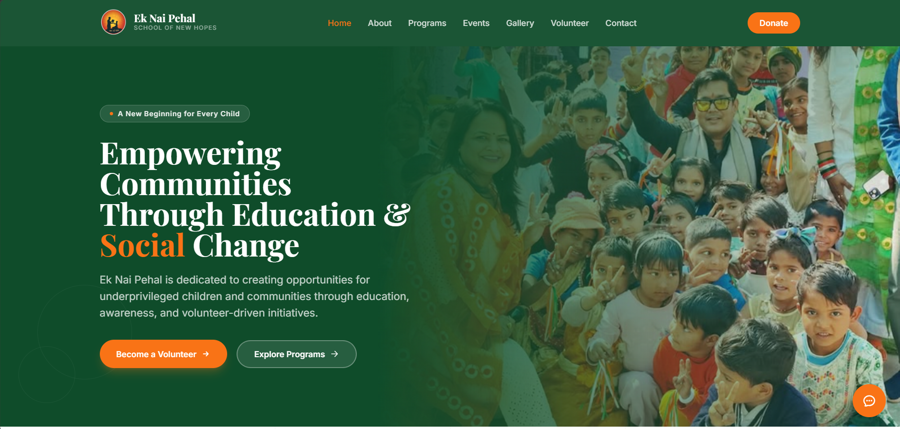
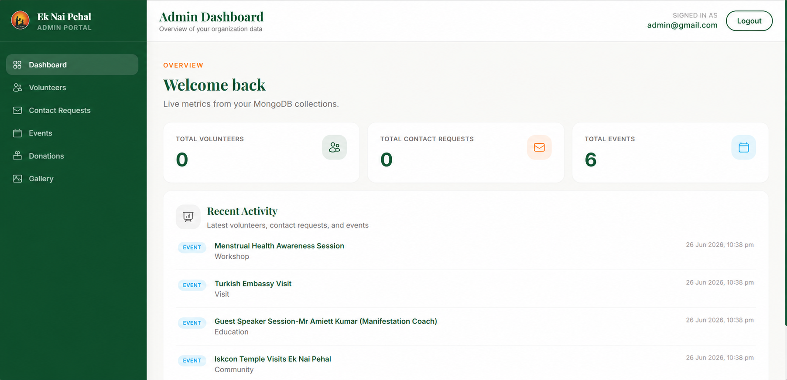
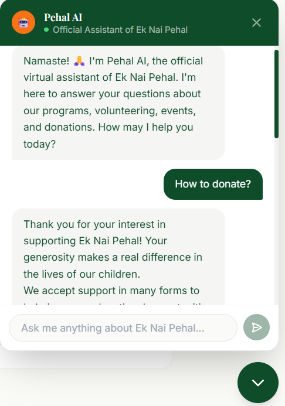
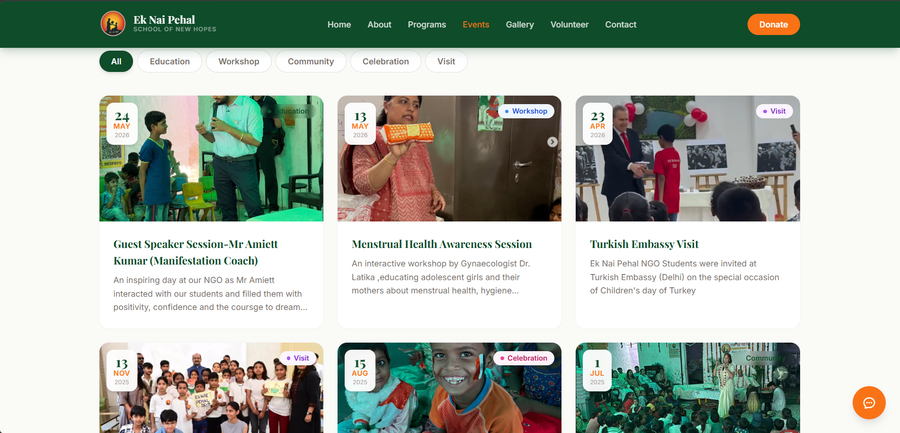
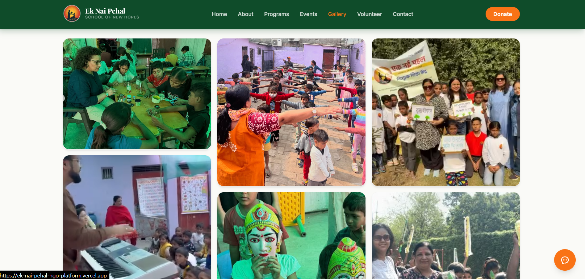
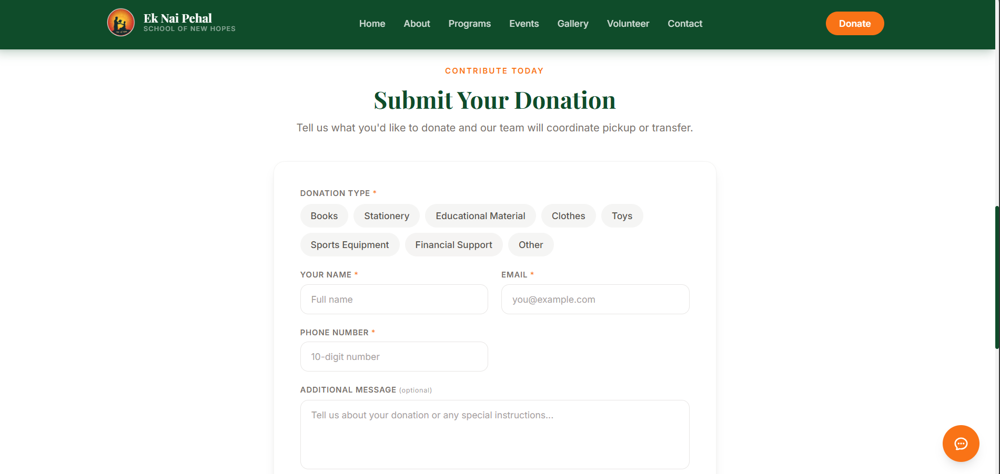

# Ek Nai Pehal – NGO Management Platform

> A full-stack MERN application designed to digitalize NGO operations by providing volunteer management, donation management, event management, gallery management, and an AI-powered virtual assistant through a secure admin dashboard.

<p align="center">
  
  
  
  
  
</p>

---

## 📖 Overview

**Ek Nai Pehal** is a complete NGO Management Platform built using the **MERN Stack** to simplify NGO operations and improve community engagement.

The platform enables visitors to explore NGO initiatives, volunteer, donate, contact the organization, and interact with an AI-powered assistant, while administrators can securely manage all dynamic content through a dedicated dashboard.

Unlike traditional static NGO websites, the platform functions as a lightweight **Content Management System (CMS)** where updates made by administrators are instantly reflected on the public website without modifying any code.

---
### 🌐 Live Demo

**Frontend:** https://ek-nai-pehal-ngo-platform.vercel.app

**Backend API:** https://ek-nai-pehal-ngo-platform.onrender.com

**Gallery API:** https://ek-nai-pehal-ngo-platform.onrender.com/api/gallery

## ✨ Features

### 🌍 Public Website

- Responsive Landing Page
- About NGO
- Programs
- Dynamic Events
- Dynamic Gallery
- Volunteer Registration
- Donation Form
- Contact Form
- AI Chatbot powered by Google Gemini
- Mobile Friendly UI

---

### 🤖 AI Assistant

The integrated chatbot is powered by **Google Gemini** and is trained on a custom NGO knowledge base.

It can answer questions regarding:

- NGO Mission
- Programs
- Volunteering
- Donations
- Contact Information
- Latest Events
- Gallery Information
- Frequently Asked Questions

---

### 🔐 Admin Dashboard

A secure JWT-authenticated dashboard allows administrators to manage the website without touching the source code.

#### Dashboard

- Live Statistics
- Recent Activity Feed

#### Volunteer Management

- View Volunteers
- Search Volunteers
- View Details
- Delete Records

#### Contact Management

- View Contact Requests
- Search Queries
- Delete Requests

#### Event Management

- Add Events
- Edit Events
- Delete Events
- Automatically updates the public website

#### Gallery Management

- Upload Images
- Edit Image Details
- Delete Images
- Featured Images Support

#### Donation Management

- View Donations
- Donation Status Tracking
- Update Donation Status
- Delete Donation Records

---

## 🏗 Project Architecture

```
                     Public Users
                          │
                          ▼
                  React Frontend
                          │
                Axios REST API Calls
                          │
                          ▼
                 Express.js Backend
                          │
          ┌───────────────┴──────────────┐
          │                              │
          ▼                              ▼
     MongoDB Atlas                 Gemini AI API
          │
          ▼
    Dynamic Website Content
```

---

## 🛠 Tech Stack

### Frontend

- React.js
- React Router
- Axios
- CSS3
- Vite

### Backend

- Node.js
- Express.js
- JWT Authentication
- bcryptjs
- Mongoose

### Database

- MongoDB Atlas

### AI Integration

- Google Gemini API

### Deployment

- Frontend: Vercel 
- Backend: Render 

---

## 📂 Project Structure

```
Ek-Nai-Pehal-NGO-Platform
│
├── client/
│   ├── src/
│   │   ├── admin/
│   │   ├── assets/
│   │   ├── components/
│   │   ├── pages/
│   │   ├── services/
│   │   └── data/
│   └── public/
│
├── server/
│   ├── config/
│   ├── controllers/
│   ├── middleware/
│   ├── models/
│   ├── routes/
│   ├── services/
│   ├── seed/
│   └── server.js
│
├── README.md
└── .gitignore
```

---

## 🚀 Installation

### Clone the Repository

```bash
git clone https://github.com/Sage9643/Ek-Nai-Pehal-NGO-Platform.git
```

### Backend

```bash
cd server

npm install

npm run dev
```

### Frontend

```bash
cd client

npm install

npm run dev
```

---

## 🔑 Environment Variables

### Backend (.env)

```env
# Server
PORT=5000

# MongoDB
MONGODB_URI=

# Gemini API
GEMINI_API_KEY=

# Admin Credentials
ADMIN_EMAIL=
ADMIN_PASSWORD_HASH=

# Authentication
JWT_SECRET=
JWT_EXPIRES_IN=7d
```

---

### Frontend (.env)

```env
# Backend API URL
VITE_API_BASE_URL=
```

---

## 📸 Screenshots

###  Home Page

<p>
  
</p>

###  Admin Dashboard

<p>
  
</p>

###  AI Chatbot

<p>
  
</p>

###  Events

<p>
  
</p>

###  Gallery

<p>
  
</p>

###  Donation Portal

<p>
  
</p>


---

## 🎯 Current Status

#### ✅ Implemented

- JWT Authentication
- AI Chatbot
- Dynamic Events
- Dynamic Gallery
- Volunteer Management
- Contact Management
- Donation Management
- Admin Dashboard
- MongoDB Integration
- Responsive Design

---

#### 🚧 Under Development

The project is actively being improved with the following planned features:

- 💳 Razorpay / Stripe Payment Gateway
- 📧 Email Notifications
- 📈 Analytics Dashboard
- ☁️ Cloudinary Image Uploads
- 👥 Multi-admin Support
- 📰 Blog & News Module
- 🔒 Role-Based Access Control
- 📑 Donation Receipts
- 📊 Export Reports (CSV/PDF)

---

## 🤝 Contributing

Contributions, suggestions and improvements are welcome.
Feel free to fork the repository and submit a pull request.

---

## 📄 License

This project is licensed under the MIT License.

---
